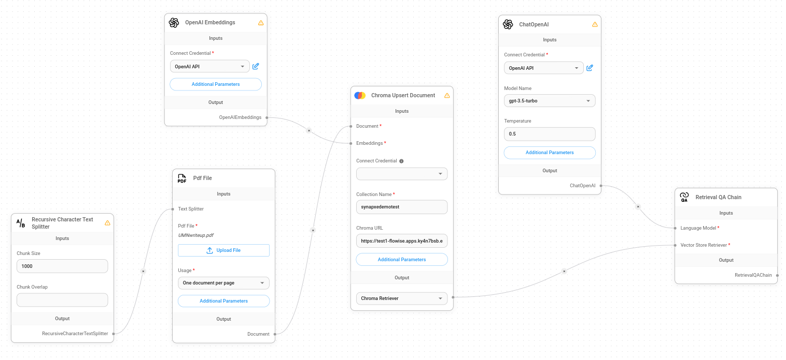

# RAG Document Summariser Demo

### Provisioning ARO

01. Provision an `Azure with ARO Open Environment (Subscription Based)` ([ARO](https://demo.redhat.com/catalog?search=aro&item=babylon-catalog-prod%2Fazure-gpte.open-environment-aro4-sub.prod)) on `demo.redhat.com`

### Create a Chatflow on Flowise

01. Deploy Flowise service using the container image `docker.io/rach228/flowise-chatflow:1.2` on ARO and ensure that the container is exposed at port 3000.

02. Open Flowise from the service running on ARO.

03. Build a chatflow based on the sample below.

### Developing HTML Frontend

A basic website html and CSS template that is used to upload a PDF file, to a flowise API. Embedded together with a Flowise API chatbot. 

To utilise this frontend, you will need to ensure that
01.  Created a flowise chatflow that is already running on an Openshift Environment or locally for your use case.
02.  OpenAI embeddings and model are connected to an OpenAI API under credentials in flowise (you will have to generate this yourself https://platform.openai.com/overview)
03.  Chatflow is functional and tested in the flowise platform

Once these prerequisites are met, you will be able to utilise this simple html and css template for your frontend.

Lines 9, 11, 12, 95 and 112 need to be replaced with the relevant API's or links that you find in flowise embedding.

Replace chatflowid and apiHost with the relevant ones found in your Flowise embeddings. (Line 9, 11, 12)

Line 95, 112 found in API_URL under Python.

04. Build your container image for your frontend.

05. Deploy your frontend on ARO and ensure that the container is exposed at port 8080.

### Deploying ChromaDB

01. Deploy ChromaDB server using the container image `docker.io/faruqzafir/test1:v1` on ARO
    * You may refer to  this article ([GenAI on OpenShift Series](https://medium.com/@bjohns_49809/gen-ai-on-openshift-series-episode-3-e77b746d607e)) on how to build your ChromaDB container

## Resources

* [GenAI on OpenShift Series](https://medium.com/@bjohns_49809/gen-ai-on-openshift-series-episode-3-e77b746d607e)